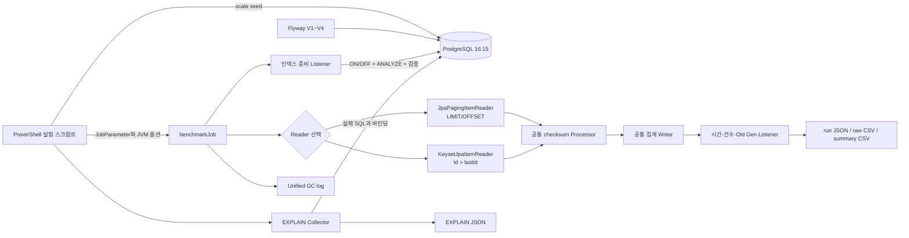
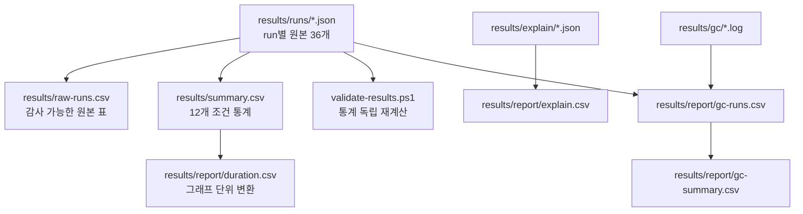

# 아키텍처

## 목적과 경계

이 프로젝트는 로컬 PostgreSQL의 합성 정산 데이터를 Spring Batch로 순차 읽으면서 `JpaPagingItemReader`의 OFFSET 방식과 사용자 정의 Keyset 방식을 같은 처리 흐름에서 비교한다. 웹 API나 외부 서비스는 없으며, 단일 JVM의 단일 스레드 Step과 Docker Compose PostgreSQL만 사용한다.

## 데이터 계층

Flyway가 Spring Batch 메타데이터, `settlement_item` 테이블, smoke 데이터와 결정적 seed 함수를 소유한다. Hibernate는 `ddl-auto=validate`만 수행하므로 실행할 때 스키마를 바꾸지 않는다.

`settlement_item`은 `id`, `status`, `customer_id`, `amount`, `settled_at`, `reference_no`, JSONB `payload`를 가진다. `id`는 고유하고 증가하며 두 Reader의 공통 정렬 키다. 공식 scale을 준비할 때 PostgreSQL `generate_series`가 READY 100k/500k/1m과 그 10%의 COMPLETED 행을 DB 내부에서 만든다. Java heap에 대량 Entity를 먼저 만들지 않는다.

공식 seed의 READY 행은 ID `1..targetRows`, COMPLETED 행은 그 뒤에 이어진다. 이 배치는 결과 해석에서 인덱스 선택과 상태 선택도의 한계로 공개한다.

## Batch 실행 계층

`benchmarkJob`의 시작 listener는 Step보다 먼저 보조 인덱스 `idx_settlement_item_status_id (status, id)`를 생성하거나 삭제하고 `ANALYZE settlement_item`을 수행한다. PostgreSQL 카탈로그에서 이름, 컬럼 순서, valid/ready와 실제 정의까지 확인한 뒤에만 Step이 시작된다. 따라서 인덱스 DDL과 통계 갱신 시간은 Reader wall-clock에 포함되지 않는다.

Step은 다음 계약을 두 Reader에 동일하게 적용한다.

| 항목 | 값 |
| --- | --- |
| 조회 상태 | `READY` |
| 정렬 | `id ASC` |
| pageSize / chunkSize | 1000 / 1000 |
| 실행 방식 | 단일 스레드 |
| Processor | `id * 31 + amount(cent)` checksum |
| Writer | 외부 쓰기 없이 count와 checksum 집계 |

OFFSET 경로는 실제 `JpaPagingItemReader`가 JPQL에 `setFirstResult`와 `setMaxResults`를 적용한다. PostgreSQL에서는 페이지가 뒤로 갈수록 증가하는 `LIMIT/OFFSET` SQL이 실행된다.

Keyset 경로는 `KeysetJpaItemReader`가 현재 페이지를 소진할 때 `WHERE status = :status AND id > :lastId ORDER BY id` JPQL과 `setMaxResults(1000)`으로 다음 페이지를 가져온다. 페이지 조회 뒤 영속성 컨텍스트를 비우며 전체 결과를 보관하지 않는다.

## 재시작 경로

Keyset Reader는 정상 반환한 마지막 ID를 `ExecutionContext`에 넣는다. Spring Batch가 chunk commit과 함께 checkpoint를 저장하므로 실패한 chunk의 미완료 상태는 커밋되지 않는다. 같은 JobInstance를 재시작하면 마지막 커밋 ID 다음부터 읽는다. ID가 연속이라는 가정은 없으며 `id > lastId` 조건으로 gap을 건너간다.

OFFSET Reader는 Spring Batch Reader의 자체 page 상태 저장 기능을 사용한다. 두 경로 모두 1001건의 두 번째 chunk에서 의도적으로 실패시킨 뒤 재시작해 누락과 중복 없이 완료되는 통합 테스트가 있다.

## 측정과 결과 계층

각 공식 run은 별도 JVM에서 실행한다. Step listener가 `System.nanoTime()`으로 Step 시작부터 종료까지 재고, 같은 구간에서 `MemoryPoolMXBean`의 `G1 Old Gen` 사용량을 50ms마다 샘플링한다. 프로세스 전체에는 512MiB 고정 heap과 G1GC unified logging이 적용된다.

결과의 데이터 흐름은 다음과 같다.

`summary.csv`는 원본을 줄여 버리는 최종 증거가 아니다. 36개 원본 run을 Reader·scale·index의 12개 조건으로 묶어 평균, 최소, 최대, 모표준편차, 규모 증가 배율과 Reader 비율을 제공하는 파생 파일이다. `validate-results.ps1`이 JSON에서 값을 다시 계산해 일치 여부를 확인한다.

EXPLAIN 수집은 Batch Step과 별도로 같은 WHERE 조건과 페이지 경계를 사용한다. FIRST/MIDDLE/LAST 위치의 실제 SQL, 바인딩, 원본 PostgreSQL JSON과 평탄화된 plan node를 함께 저장한다. EXPLAIN 자체 시간은 Step 결과에 합산하지 않는다.

## 주요 코드 위치

- `src/main/java/dev/benchmark/batchreader/reader/`: OFFSET factory와 Keyset Reader/page source
- `src/main/java/dev/benchmark/batchreader/batch/`: 공통 Processor/Writer와 개별 Reader Job
- `src/main/java/dev/benchmark/batchreader/benchmark/`: benchmark Job, 지표 listener, Old Gen sampler와 결과 저장
- `src/main/java/dev/benchmark/batchreader/experiment/`: 로컬 DB guard, 인덱스와 EXPLAIN 수집
- `src/main/resources/db/migration/`: 스키마, smoke seed와 결정적 scale seed
- `scripts/`: seed, 단일 run, 전체 matrix, 환경·결과·보고서 데이터 생성
- `results/`: 공식 원본, 요약과 보고서용 파생 데이터
